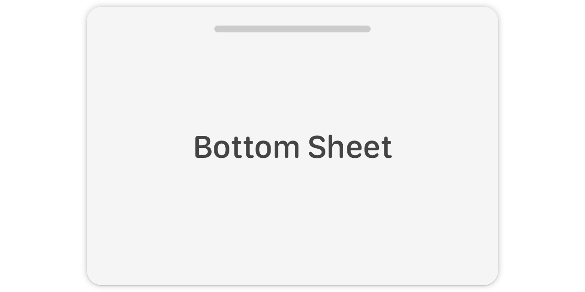

# BottomSheet

<p align="center">
    <br />
    
    
    
    
    <a href="https://twitter.com/danielsaidi">
        
    </a>
</p>


## About BottomSheet

`BottomSheet` makes it easy to add custom bottom sheets to your `SwiftUI` apps. 

The result can look like this...or completely different:

<p align="center">
    
</p>

These sheets have a default style, but can be customized to fit your specific app. 


## Installation

### Swift Package Manager

```
https://github.com/danielsaidi/BottomSheet.git
```

### CocoaPods

```
pod DSBottomSheet
```


## How does it work

`BottomSheet` contains a `BottomSheet` `SwiftUI` view, that can be created with an `isExpanded` binding, a `minHeight` and `maxHeight` and a `style`.

```swift
let sheet = BottomSheet(
    isExpanded: $isSheetExpanded,
    minHeight: .points(100)
    maxHeight: .available
    style: .standard
)
```

Once you have a sheet view, you can add it to any view, using the `bottomSheet` modifier: 

```swift
List(items) { item
   HStack { item.name }
}.bottomSheet(sheet)
```

The sheet will be added above the view and docked to the bottom. The sheet can now be either swiped up or expanded and collapsed by tapping the handle.


## Heights

`BottomSheet` is created with a `minHeight` and `maxHeight`, which are `BottomSheetHeight` enums with these cases:

* `available` - the total available height
* `percentage` - a percentage of the total available height
* `points` - a fixed number of points

You can set these to control how tall your sheet can become and how much it can collapse. You can change these properties at any time.


## Styling

`BottomSheet` is created with a `style`, which is a `BottomSheetStyle` with these properties:

* `color` - the color of the sheet
* `cornerRadius` - the corner radius of the sheet
* `modifier` - the modifier to apply to the sheet
* `snapRatio` - the percent of the max height, after which the sheet slides to the full height
* `handleStyle` - the bottom sheet's handle style

You can define your own bottom sheet and ottom sheet handle styles and apply them when creating a sheet.


## Important

This library uses resource-based colors, which aren't available to SwiftUI previews outside of this library.

Make sure to always use the `.preview` style when previewing a sheet.


## Demo app

This repo contains a basic demo app that demonstrates how to use the bottom sheet.

Just open the `Demo` project and run the app.


## Acknowledgements

This library is based on [this amazing gist][MecidGist] by [@mecid][Mecid]. It would not have been made without him, so big thanks for putting that gist out into the world.


## Contact me

Feel free to reach out if you have questions or if you want to contribute in any way:

* E-mail: [daniel.saidi@gmail.com][Email]
* Twitter: [@danielsaidi][Twitter]
* Web site: [danielsaidi.com][Website]


## License

BottomSheet is available under the MIT license. See LICENSE file for more info.


[Email]: mailto:daniel.saidi@gmail.com
[Twitter]: http://www.twitter.com/danielsaidi
[Website]: http://www.danielsaidi.com

[Mecid]: http://www.twitter.com/mecid
[MecidGist]: https://gist.github.com/mecid/78eab34d05498d6c60ae0f162bfd81ee
